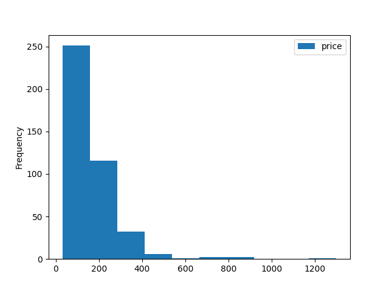
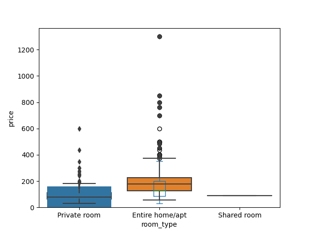
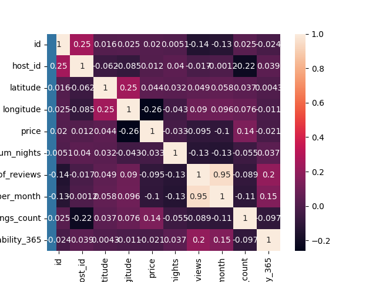
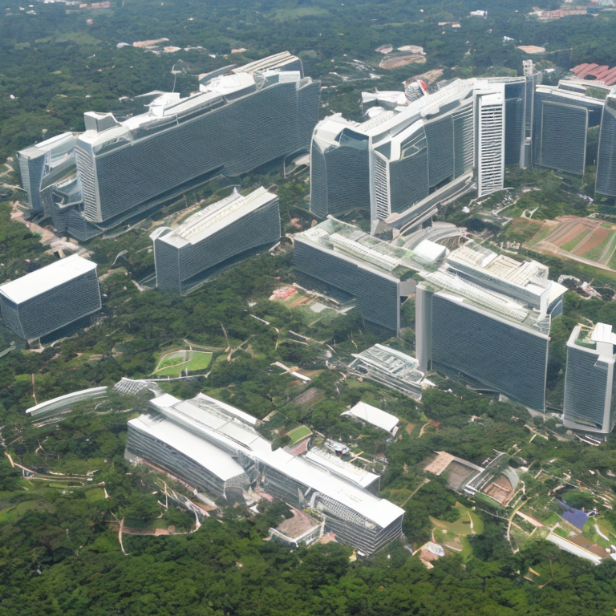
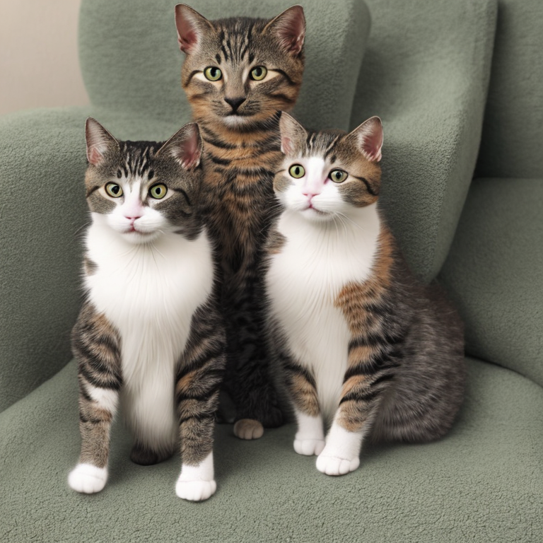
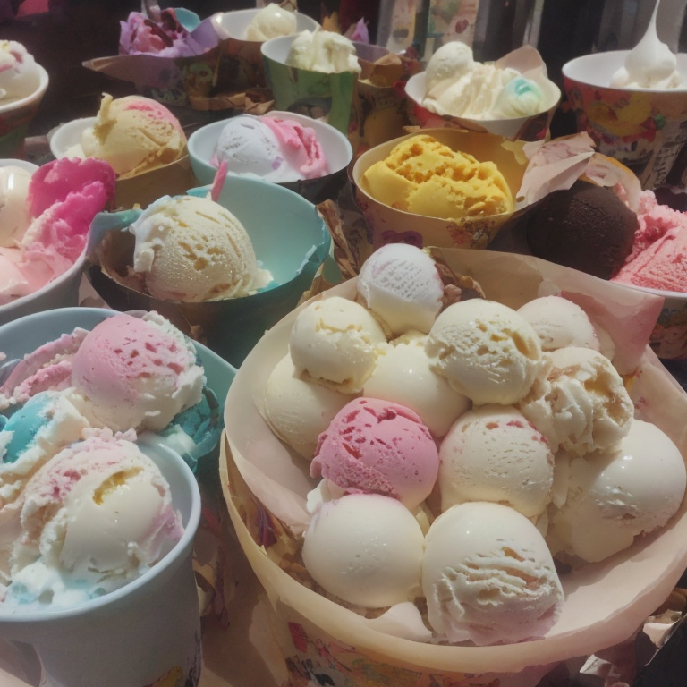
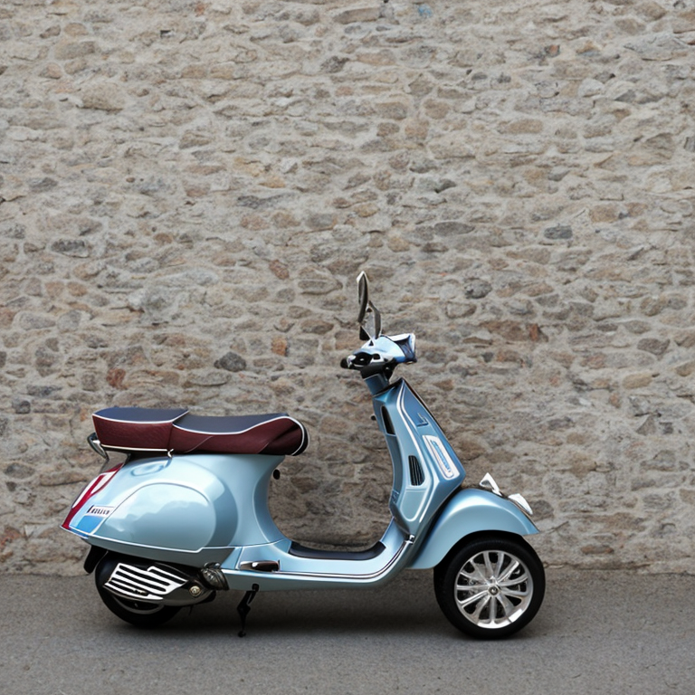

# Fleximasters

## Group and individual work for NTU's FlexiMasters in Business and Financial Analytics

### We covered Tableau, MySQL, KNIME, Orange, ChatGPT, snatchbot, etc...

#### As much as I would like to showcase many items, I need to be mindful of copyright / school's IP etc, and also to be careful not to leak answers for the future batches. Hence, I will only show a select few as appropriate.

#### Modules:
• AI and Analytics Technologies in Enterprise\
• AI and Analytics in Finance, Credit and Related Risks\
• Data Management and Visualization\
• Design Thinking, Blockchain Technology Management and Cybersecurity

###### Tableau showcase for showing HDB resale prices trend. Our group's framing focused on elderly looking to downgrade HDB flats.

https://github.com/zyteo/fleximasters/assets/86465458/cd76924c-f1ff-4c93-9d0f-e559d2edb4f9

###### ML model made with Teachable Machine.

https://recycling-ai-model1.netlify.app/

###### Histogram generated with df.plot.

###### Boxplot generated with snsplot.

###### Heatmap generated with snsplot.

###### Pair plot generated with snsplot.

###### AI-generated image of NTU SG.

###### AI-generated image of cats.

###### AI-generated image of ice cream from Japan.

###### AI-generated image of Vespa.

###### Telegram bot created with snatchbot. As we used a free trial, the bot has since expired.

https://github.com/zyteo/fleximasters/assets/86465458/741ffc38-f677-4a3a-967a-be79c278a7ab

###### Chat with ChatGPT. Uses openAI API for ChatGPT. As credits are limited, I show a sample video.

https://github.com/zyteo/fleximasters/assets/86465458/bf3f0546-2487-418d-92ac-2de8a4aff7b8
