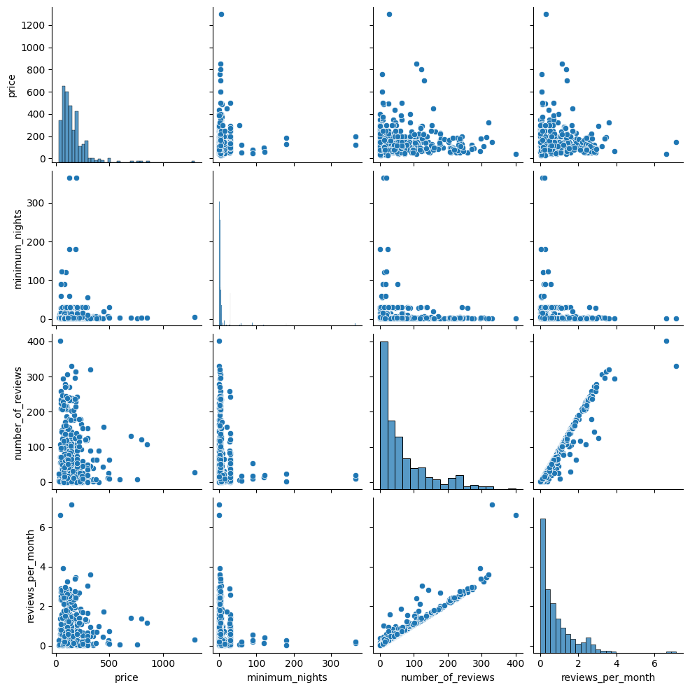

# Fleximasters
## Some showcase of my group and individual work done for NTU's FlexiMasters in Business and Financial Analytics
### Throughout the modules, we covered Tableau, MySQL, KNIME, Orange, ChatGPT, snatchbot, etc...
#### As much as I would like to showcase many items, I need to be mindful of copyright / school's IP etc, and also to be careful not to leak answers for the future batches. Hence, I will only show a select few as appropriate.

###### Tableau showcase for showing HDB resale prices trend. Our group's framing focused on elderly looking to downgrade HDB flats.

https://raw.githubusercontent.com/zyteo/fleximasters/main/tableau-video.mp4

###### ML model made with Teachable Machine.

https://recycling-ai-model1.netlify.app/ 

###### Histogram generated with df.plot.

###### Boxplot generated with snsplot.

###### Heatmap generated with snsplot.

###### Pair plot generated with snsplot.

###### AI-generated image of NTU SG.

###### AI-generated image of cats.

###### AI-generated image of ice cream from Japan.

###### AI-generated image of Vespa.

###### Telegram bot created with snatchbot. As we used a free trial, the bot has since expired.

https://raw.githubusercontent.com/zyteo/fleximasters/main/telebot-sample.mp4

###### Chat with ChatGPT. Uses openAI API for ChatGPT. As credits are limited, I show a sample video.

https://raw.githubusercontent.com/zyteo/fleximasters/main/chatgpt-sample.mp4
